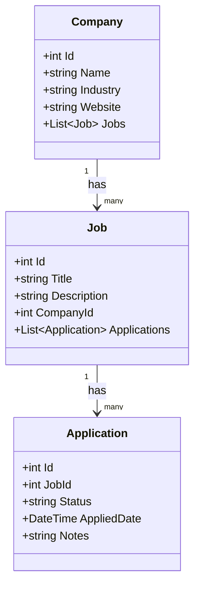

# Job Tracker Backend

Clean Architecture .NET Core API for tracking job applications.

## Technologies
- .NET 8 / ASP.NET Core Web API
- Entity Framework Core + SQL Server
- MediatR (CQRS)
- Repository Pattern
- xUnit + Moq
- Swagger

## Projects
- JobTracker.API
- JobTracker.Application
- JobTracker.Domain
- JobTracker.Infrastructure
- JobTracker.Tests

## How to run
1. Clone this repo
2. Update connection string in appsettings.json
3. Package Manager Console: Update-Database -StartupProject JobTracker.API
4. Press F5
5. Open https://localhost:PORT/swagger

## API Documentation
Swagger UI available at: https://localhost:PORT/swagger
All endpoints documented with request/response models.

## UML Class Diagram

## User Flow
User opens app → sees Companies → clicks Company
→ sees Jobs → clicks Job → sees Applications
→ changes Application Status