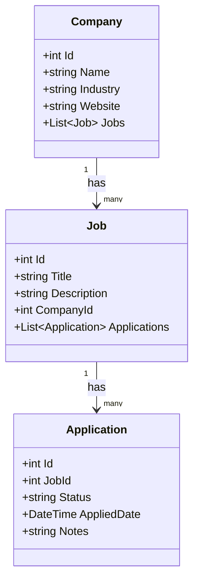

# Job Tracker Backend

.NET Core Web API with Clean Architecture.

## Tech
- .NET 8, ASP.NET Core
- Entity Framework Core + SQL Server
- MediatR (CQRS)
- Repository Pattern
- xUnit + Moq
- Swagger

## How to run
1. Clone the repo
2. Open `JobTracker.sln` in Visual Studio
3. Package Manager Console → run:
   ```
   Update-Database -StartupProject JobTracker.API -Project JobTracker.Infrastructure
   ```
4. Press F5
5. Open `https://localhost:PORT/swagger`

## Models
- Company → has many Jobs
- Job → belongs to Company, has many Applications
- Application → belongs to Job, has a Status

## Status values
Applied · Interview · Offer · Rejected

## UML Class Diagram


